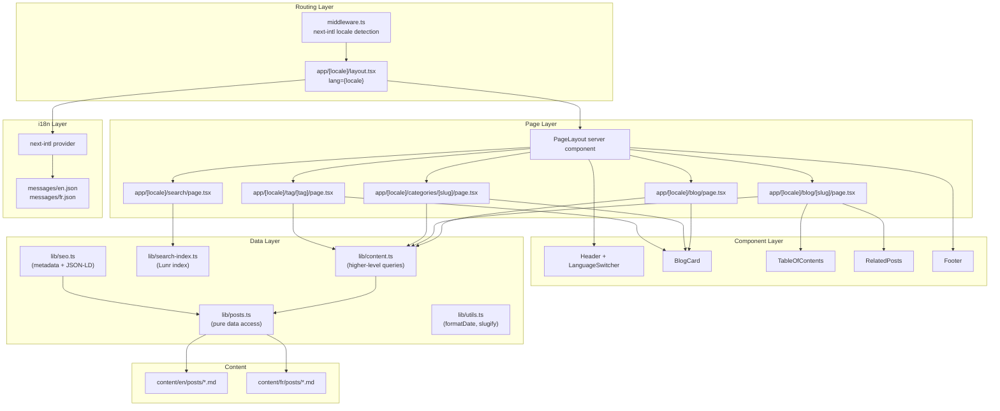

# Design Document

## Multi-Language Blog Platform Refactor

---

## Overview

This document describes the technical design for refactoring the existing Next.js 15 App Router SEO blog into a production-grade, multi-language (i18n), SEO-first content platform.

The refactor is a quality-and-correctness pass, not a feature addition. The goals are:

1. Fix structural bugs and type mismatches in the existing code
2. Eliminate duplicated logic across layers
3. Add full `next-intl` i18n support with locale-scoped routing and content
4. Introduce a tags system
5. Add GSAP animations with reduced-motion support
6. Establish a testable architecture with property-based tests for the search layer

The existing public-facing behaviour (routes, content, UI) is preserved. No net-new user-facing features are introduced beyond what the requirements specify.

---

## Architecture

### High-Level Layer Diagram



### Key Architectural Decisions

**Decision 1 — Split `lib/posts.ts` into two modules**
`lib/posts.ts` becomes pure data access (read file, parse frontmatter, render HTML). A new `lib/content.ts` owns higher-level queries (`getFeaturedPosts`, `getPostsByCategory`, `getPaginatedPosts`, `getRelatedPosts`). This keeps the data layer testable in isolation.

**Decision 2 — In-memory slug map cache**
`lib/posts.ts` builds a `Map<slug, filename>` on first call and reuses it. `getPostBySlug` becomes O(1) after warm-up instead of O(n) file reads.

**Decision 3 — `PostMetadata` vs `Post` split**
List pages (blog index, category, tag, search) only need frontmatter. They call `getAllPostMetadata()` which skips HTML rendering. Only the post detail page calls `getPostBySlug()` which returns the full `Post` with `html`.

**Decision 4 — `next-intl` with `app/[locale]/` routing**
All routes are nested under `app/[locale]/`. `middleware.ts` handles locale detection and cookie persistence. The `<html lang>` attribute is set dynamically from the active locale.

**Decision 5 — `buildNextMetadata` rename**
`lib/seo.ts`'s `generateMetadata` helper is renamed to `buildNextMetadata` to avoid shadowing the Next.js page-level export of the same name.

**Decision 6 — GSAP loaded client-side only**
GSAP and ScrollTrigger are imported only inside `'use client'` components, wrapped in `useEffect`, and gated behind a `prefers-reduced-motion` check.

---

## Components and Interfaces

### `lib/posts.ts` — Pure Data Access

```typescript
// Zod schema for frontmatter validation
const PostFrontmatterSchema = z.object({
  title: z.string(),
  slug: z.string(),
  excerpt: z.string(),
  author: z.string(),
  date: z.string(),
  category: z.string(),
  readTime: z.number(),
  featured: z.boolean().default(false),
  tags: z.array(z.string()).default([]),
});

export type PostMetadata = z.infer<typeof PostFrontmatterSchema>;

export interface Post extends PostMetadata {
  content: string; // raw markdown
  html: string;    // rendered HTML
}

// Public API
export function getAllPostMetadata(locale?: string): PostMetadata[]
export function getPostBySlug(slug: string, locale?: string): Post | null
export function getAllPosts(locale?: string): Post[]
```

### `lib/content.ts` — Higher-Level Queries

```typescript
export function getFeaturedPosts(locale?: string): PostMetadata[]
export function getPostsByCategory(category: string, locale?: string): PostMetadata[]
export function getPaginatedPosts(page: number, perPage?: number, locale?: string): PaginationResult
export function getRelatedPosts(slug: string, category: string, limit?: number, locale?: string): PostMetadata[]
export function getAllCategories(locale?: string): string[]
export function getAllTags(locale?: string): string[]
export function getPostsByTag(tag: string, locale?: string): PostMetadata[]
```

### `lib/search-index.ts` — Search Layer

```typescript
export interface SearchDocument {
  id: string;
  title: string;
  excerpt: string;
  category: string;
  author: string;
  tags: string;
  slug: string;
}

export interface SearchIndexPayload {
  documents: SearchDocument[];
  index: string; // serialised Lunr JSON
}

// Module-level cache — built once per server process
let _cachedIndex: lunr.Index | null = null;
let _cachedDocuments: SearchDocument[] | null = null;

export function getOrBuildSearchIndex(): SearchIndexPayload
export function searchPosts(query: string): SearchDocument[]
```

### `lib/seo.ts` — SEO Layer

```typescript
export const SITE_CONFIG = {
  name: 'SEO Blog Platform',
  description: '...',
  defaultLocale: 'en',
  supportedLocales: ['en', 'fr'],
} as const;

export function buildNextMetadata(seo: SEOMetadata): Metadata
export function generatePostSEOMetadata(post: PostMetadata, locale: string): SEOMetadata
export function generateArticleSchema(post: Post): object  // includes dateModified
export function generateOrganizationSchema(): object
```

### `lib/utils.ts` — Shared Utilities

```typescript
export function cn(...inputs: ClassValue[]): string
export function formatDate(dateString: string, locale?: string): string
export function slugifyTag(tag: string): string  // lowercase, spaces→hyphens, strip non-alphanumeric
```

### `components/page-layout.tsx` — Shared Page Wrapper

```typescript
// Server component
interface PageLayoutProps {
  children: React.ReactNode;
  locale: string;
}
export default function PageLayout({ children, locale }: PageLayoutProps)
// Renders: <Header locale={locale} /> + <main>{children}</main> + <Footer />
```

### `components/header.tsx` — Header + LanguageSwitcher

```typescript
// Client component
interface HeaderProps {
  locale: string;
}
// Includes <LanguageSwitcher> sub-component that:
// - renders locale options from SITE_CONFIG.supportedLocales
// - on select: navigates to /[newLocale]/[...rest] and sets NEXT_LOCALE cookie
```

### `components/blog-card.tsx` — Blog Card

```typescript
interface BlogCardProps {
  post: PostMetadata;
  locale?: string;
}
// Uses formatDate(post.date, locale)
// Renders tag badges linking to /[locale]/tag/[slugifyTag(tag)]
// Root element is <article> wrapped in <Link> — NOT double-wrapped by parent
```

### `components/table-of-contents.tsx` — TOC

```typescript
interface Heading { id: string; level: number; text: string; }

interface TableOfContentsProps {
  headings: Heading[]; // extracted server-side, passed as prop
}
// Client component for scroll-spy and GSAP active-item animation
// Headings are extracted in the server component from rendered HTML
```

### `components/related-posts.tsx` — Related Posts

```typescript
interface RelatedPostsProps {
  posts: PostMetadata[]; // passed from parent server component
  locale: string;
}
// Pure presentational server component — no internal data fetching
```

### `middleware.ts` — Locale Routing

```typescript
// next-intl createMiddleware with:
// - locales: ['en', 'fr']
// - defaultLocale: 'en'
// - localeDetection: true (Accept-Language header)
// - localeCookie: 'NEXT_LOCALE'
```

---

## Data Models

### Content Directory Structure

```
content/
  en/
    posts/
      seo-fundamentals.md
      keyword-research-guide.md
      ...
  fr/
    posts/
      seo-fundamentals.md   ← optional; falls back to en if absent
      ...
```

Migration path: existing `content/posts/` files are moved to `content/en/posts/` during the refactor. Existing slugs are preserved.

### Post Frontmatter Schema (Zod)

```typescript
const PostFrontmatterSchema = z.object({
  title:    z.string(),
  slug:     z.string(),
  excerpt:  z.string(),
  author:   z.string(),
  date:     z.string().datetime({ offset: true }).or(z.string().regex(/^\d{4}-\d{2}-\d{2}$/)),
  category: z.string(),
  readTime: z.number().int().positive(),
  featured: z.boolean().default(false),
  tags:     z.array(z.string()).default([]),
});
```

If a required field is missing, Zod throws a `ZodError` with the filename and field name included in the message (wrapped by `parsePost`).

### Slug-to-Filename Cache

```typescript
// Module-level, populated on first getAllPostMetadata() call
const slugMap = new Map<string, string>(); // slug → filename (e.g. "seo-fundamentals" → "seo-fundamentals.md")
```

### URL Structure

| Route | Path |
|---|---|
| Home | `/[locale]` |
| Blog index | `/[locale]/blog` |
| Blog post | `/[locale]/blog/[slug]` |
| Category | `/[locale]/categories/[slug]` |
| Tag | `/[locale]/tag/[tag]` |
| Search | `/[locale]/search` |
| Contact | `/[locale]/contact` |

### Translation Message Files

```json
// messages/en.json (excerpt)
{
  "nav": { "home": "Home", "blog": "Blog", "categories": "Categories" },
  "blog": { "backToBlog": "Back to Blog", "relatedPosts": "Related Posts", "readMore": "Read more" },
  "search": { "placeholder": "Search articles...", "noResults": "No results for \"{query}\"" },
  "i18n": { "translationUnavailable": "This article is not yet available in {locale}. Showing English version." }
}
```

### Environment Variables

| Variable | Required | Default | Purpose |
|---|---|---|---|
| `NEXT_PUBLIC_SITE_URL` | Production | `http://localhost:3000` | Base URL for canonical/OG URLs |

---

## Correctness Properties

*A property is a characteristic or behavior that should hold true across all valid executions of a system — essentially, a formal statement about what the system should do. Properties serve as the bridge between human-readable specifications and machine-verifiable correctness guarantees.*

### Property 1: Search results are a subset of all posts

*For any* non-empty search query string, the set of slugs returned by the search layer SHALL be a subset of the set of all post slugs. Search only filters; it never introduces posts that do not exist.

**Validates: Requirements 7.6, 14.3**

---

### Property 2: Search index round-trip preserves results

*For any* non-empty search query, building a Lunr index, serialising it to JSON, deserialising it, and running the same query SHALL return the same set of result slugs as the original index.

**Validates: Requirements 14.4**

---

### Property 3: Tag slugification is idempotent and URL-safe

*For any* tag string, `slugifyTag` SHALL satisfy two invariants simultaneously: (1) applying it twice produces the same result as applying it once (`slugifyTag(slugifyTag(tag)) === slugifyTag(tag)`), and (2) the output contains only lowercase alphanumeric characters and hyphens with no leading or trailing hyphens.

**Validates: Requirements 12.6**

---

### Property 4: `formatDate` output contains the year

*For any* valid ISO date string, `formatDate(dateString, locale)` SHALL return a string that contains the four-digit year from the input date.

**Validates: Requirements 9.2**

---

### Property 5: `parsePost` preserves required frontmatter fields

*For any* valid markdown file with well-formed frontmatter, parsing it with `parsePost` SHALL produce a `Post` object whose `title`, `slug`, `author`, `date`, `category`, and `excerpt` fields equal the values in the frontmatter.

**Validates: Requirements 1.1, 6.3**

---

## Error Handling

### Content Layer Errors

- **Missing required frontmatter field**: `parsePost` wraps the Zod parse result; on failure it throws `Error: [filename]: missing required field "title"`. This surfaces at build time during `generateStaticParams`.
- **File not found**: `getPostBySlug` returns `null`; pages call `notFound()`.
- **Locale fallback**: When `content/[locale]/posts/[slug].md` does not exist, `getPostBySlug` falls back to `content/en/posts/[slug].md` and the page renders a `TranslationUnavailableNotice` banner.

### Search Layer Errors

- **Invalid Lunr query syntax** (e.g. trailing `~`): caught in a `try/catch` inside `useSearch`; returns `[]` and sets no error state (graceful degradation).
- **Search index fetch failure**: `useSearch` sets `error` state; the search page renders an inline error message.

### SEO Layer Errors

- **Missing `NEXT_PUBLIC_SITE_URL` in production**: `lib/seo.ts` logs a `console.warn` and falls back to `http://localhost:3000`. A build-time check in `next.config.mjs` can enforce this via an environment variable assertion.

### i18n Errors

- **Unknown locale in URL**: `middleware.ts` redirects to the default locale.
- **Missing translation key**: `next-intl` falls back to the key name and logs a warning in development.

---

## Testing Strategy

### Unit Tests (Vitest)

**Content Layer** (`lib/posts.ts`):
- `parsePost` with valid frontmatter → correct `Post` shape
- `parsePost` with missing `title` → throws descriptive error
- `parsePost` with missing `slug` → throws descriptive error
- `getPostBySlug` with known slug → returns correct post
- `getPostBySlug` with unknown slug → returns `null`

**SEO Layer** (`lib/seo.ts`):
- `buildNextMetadata` output shape includes `title`, `description`, `openGraph`, `twitter`
- `generateArticleSchema` output includes `@type: BlogPosting`, `datePublished`, `dateModified`
- Canonical URL without locale → `https://example.com/blog/slug`
- Canonical URL with locale → `https://example.com/en/blog/slug`

**Utility Layer** (`lib/utils.ts`):
- `slugifyTag("Hello World!")` → `"hello-world"`
- `slugifyTag("  spaces  ")` → `"spaces"`
- `formatDate("2024-01-15", "en")` → contains `"2024"`

### Property-Based Tests (fast-check)

The project uses **[fast-check](https://fast-check.dev/)** for property-based testing (TypeScript-native, no additional runtime dependencies).

Each property test runs a minimum of **100 iterations**.

**Property 1 — Search results are a subset of all posts**
```
Feature: multi-language-blog-platform, Property 1: search results are a subset of all posts
```
Generate: arbitrary non-empty string query. Assert: every slug in results exists in `getAllPostMetadata().map(p => p.slug)`.

**Property 2 — Search index round-trip**
```
Feature: multi-language-blog-platform, Property 2: search index round-trip preserves results
```
Generate: arbitrary non-empty string query. Assert: `originalIndex.search(q).map(r=>r.ref)` equals `deserialisedIndex.search(q).map(r=>r.ref)`.

**Property 3 — Tag slugification idempotence and URL-safety**
```
Feature: multi-language-blog-platform, Property 3: slugifyTag is idempotent and URL-safe
```
Generate: arbitrary string. Assert: (1) `slugifyTag(slugifyTag(s)) === slugifyTag(s)` and (2) output matches `/^[a-z0-9]+(-[a-z0-9]+)*$|^$/`.

**Property 4 — `formatDate` contains year**
```
Feature: multi-language-blog-platform, Property 4: formatDate output contains the year
```
Generate: arbitrary valid ISO date string (year 2000–2099). Assert: output string contains the four-digit year.

**Property 5 — `parsePost` preserves required frontmatter fields**
```
Feature: multi-language-blog-platform, Property 5: parsePost preserves required frontmatter fields
```
Generate: arbitrary valid frontmatter objects. Write to a temp file, parse, assert field equality.

### Integration Tests

- `GET /api/search-index` → response body has `documents` array and non-empty `index` string
- Blog post page metadata → includes `title`, `description`, `openGraph.title`, JSON-LD `<script>` with `@type: BlogPosting`

### Test Configuration

```typescript
// vitest.config.ts
import { defineConfig } from 'vitest/config'
export default defineConfig({
  test: {
    environment: 'node',
    include: ['**/*.test.ts'],
  },
})
```

Property tests are tagged with comments matching the format:
```typescript
// Feature: multi-language-blog-platform, Property N: <property text>
```
